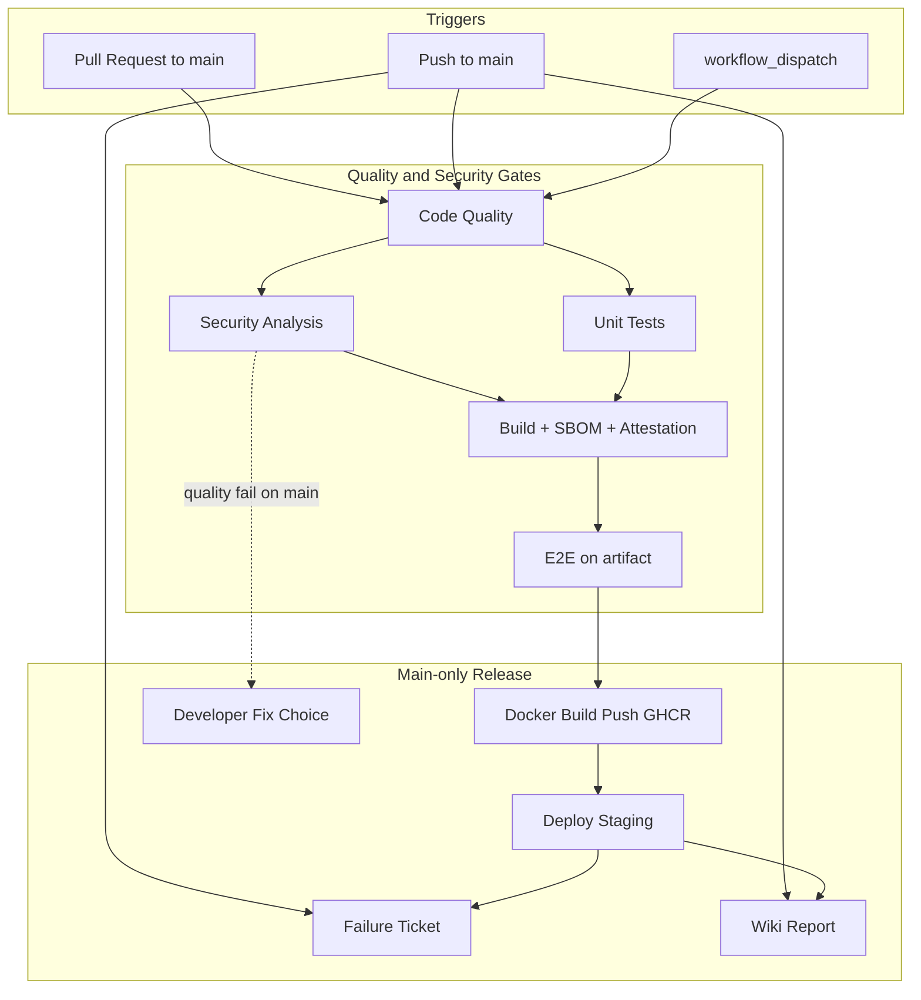

# Enterprise CI/CD Pipeline — Complete Documentation

This document describes the full **Enterprise React CI/CD Pipeline**: how it works, every stage, security controls, artifact flow, deployment, failure handling, and setup requirements.

**Related:** [SETUP-GUIDE.md](./SETUP-GUIDE.md) — complete setup from zero (server, secrets, first deploy).

---

## Table of contents

1. [Overview](#overview)
2. [Architecture](#architecture)
3. [Triggers and execution paths](#triggers-and-execution-paths)
4. [Pipeline stages (detailed)](#pipeline-stages-detailed)
5. [Developer Fix Choice workflow](#developer-fix-choice-workflow)
6. [Artifact model (build once)](#artifact-model-build-once)
7. [Security hardening (Phase 1)](#security-hardening-phase-1)
8. [Staging deployment](#staging-deployment)
9. [Failure tickets and Wiki reports](#failure-tickets-and-wiki-reports)
10. [GitHub Environments and secrets](#github-environments-and-secrets)
11. [Branch protection setup](#branch-protection-setup)
12. [Developer workflow](#developer-workflow)
13. [Artifacts reference](#artifacts-reference)
14. [Scripts reference](#scripts-reference)
15. [Troubleshooting](#troubleshooting)
16. [Not yet implemented (production)](#not-yet-implemented-production)

---

## Overview

The pipeline is defined in:

| File | Purpose |
| --- | --- |
| `.github/workflows/enterprise-ci-cd.yml` | Main CI/CD pipeline (quality → Docker → staging) |
| `.github/workflows/developer-fix-choice.yml` | Developer-approved auto vs manual fix |
| `scripts/deploy.sh` | Staging Docker deploy (`docker pull` / `docker run`) |
| `scripts/health-check.sh` | Post-deploy validation |
| `scripts/create-failure-ticket.sh` | GitHub Issue on failure |
| `scripts/publish-wiki-report.sh` | Wiki report after each main run |
| `Dockerfile` / `nginx.conf` | Runtime image serving CI-built `dist/` |

**Design principles:**

- **Build once** — a single production build is reused by E2E, the Docker image, and staging deploy
- **Least privilege** — default `permissions: contents: read`; jobs elevate only when needed
- **No silent dependency mutation** — CI never runs `npm audit fix`
- **Environment-scoped secrets** — deploy/build secrets live in GitHub Environments
- **Observable failures** — GitHub Issues + Wiki reports on `main`

**Runtime stack:** Node.js 20 (CI build), React 18, Vite, Vitest, Playwright, Docker + nginx on Ubuntu staging (VMware, Oracle VM, EC2, or any SSH host), images on GHCR.

---

## Architecture



---

## Triggers and execution paths

Configured in `enterprise-ci-cd.yml`:

```yaml
on:
  push:
    branches: [main]
  pull_request:
    branches: [main]
  workflow_dispatch:
```

### What runs on each trigger

| Trigger | Jobs that run | Jobs skipped |
| --- | --- | --- |
| **Pull request → `main`** | Code Quality, Security, Unit Tests, Build, E2E | Docker push, Deploy, Failure Ticket, Wiki, Await Fix Decision |
| **Push → `main`** | All stages including Docker, deploy, tickets, wiki | — |
| **`workflow_dispatch`** | Same as push (including Docker + deploy) | — |
| **Push to other branches** | Nothing | Entire pipeline |

### Concurrency

```yaml
concurrency:
  group: ${{ github.workflow }}-${{ github.ref }}
  cancel-in-progress: true
```

Only one run per branch/ref at a time; newer runs cancel in-progress runs on the same ref.

---

## Pipeline stages (detailed)

### Stage 1 — Code Quality Checks

**Job name:** `Code Quality Checks`  
**Runs on:** PR, push, manual  
**Depends on:** nothing  

| Step | Command | Purpose |
| --- | --- | --- |
| ESLint | `npm run lint` | Code style, React rules, security plugin |
| Prettier | `npm run format:check` | Formatting consistency |
| TypeScript | `npx tsc --noEmit` | Static type checking |

**Fails when:** lint errors, format drift, or type errors exist.

---

### Stage 2 — Security Analysis

**Job name:** `Security Analysis`  
**Runs on:** PR, push, manual  
**Permissions:** `security-events: write` (for SARIF upload)

| Tool | What it does | Fails pipeline? |
| --- | --- | --- |
| **npm audit** | Dependency vulnerabilities | Yes (high/critical) |
| **npm audit fix --dry-run** | Informational report only | No (`continue-on-error`) |
| **TruffleHog** | Secret scanning (verified secrets) | Yes (on findings) |
| **CodeQL** | SAST for JavaScript | Yes (on findings) |
| **Trivy** | Filesystem/config vulnerability scan | Results uploaded to Security tab |

TruffleHog uses different base/head depending on event:

- **PR:** `pull_request.base.sha` → `pull_request.head.sha`
- **Push:** `event.before` → `event.sha`
- **Manual:** full repo scan

---

### Stage 2.5 — Await Developer Fix Decision

**Job name:** `Await Developer Fix Decision`  
**Runs on:** push to `main` only, when Code Quality **or** Security fails  
**Does not run on:** pull requests  

Creates or updates a failure GitHub Issue with instructions to choose `fix/auto` or `fix/manual`. See [Developer Fix Choice workflow](#developer-fix-choice-workflow).

---

### Stage 3 — Unit Tests

**Job name:** `Unit Tests`  
**Runs on:** PR, push, manual  
**Depends on:** Code Quality  

| Step | Command | Output |
| --- | --- | --- |
| Vitest + coverage | `npm run test:coverage` | `coverage-report` artifact (7 days) |

**Note:** Coverage is collected but there is currently **no minimum threshold** gate.

---

### Stage 4 — Build & Bundle Analysis

**Job name:** `Build & Bundle Analysis`  
**Runs on:** PR, push, manual  
**Depends on:** Code Quality, Security, Unit Tests  
**Environment:** `ci` (for `VITE_API_URL`)

This is the **single build** for the pipeline run.

| Step | Description |
| --- | --- |
| `npm run build` | Production Vite build → `dist/` |
| Bundle analysis | Logs `dist/` size and largest files |
| Build verification | Ensures `dist/index.html` exists |
| SBOM | CycloneDX JSON via `anchore/sbom-action` |
| Release bundle | `app-dist-<sha>.tar.gz` + SBOM + `SHA256SUMS` |
| Upload artifacts | `build-artifact` + `app-dist-<sha>-bundle` |
| Attestation | GitHub build provenance on the tarball |

**Permissions:** `id-token: write`, `attestations: write` (required for attestation).

---

### Stage 5 — E2E Tests

**Job name:** `E2E Tests`  
**Runs on:** PR, push, manual  
**Depends on:** Build  

Tests run against the **exact `dist/` artifact** from Stage 4:

1. Download `build-artifact`
2. Start `vite preview` locally (Playwright `webServer`)
3. Run Playwright across 5 browser projects

**Browser projects:** Chromium, Firefox, WebKit, Mobile Chrome, Mobile Safari.

**Test file:** `tests/e2e/navigation.spec.js`

| Test | What it validates |
| --- | --- |
| Homepage loads | Title + `h1` content |
| Navigation | About, Contact routes |
| 404 page | Unknown routes |
| Mobile menu | Toggle visibility |
| Contact form | Submission success message |

**Output:** `playwright-report` artifact (HTML + JUnit XML).

---

### Stage 6 — Build & Push Docker Image

**Job name:** `Build & Push Docker Image`  
**Runs on:** push to `main` and `workflow_dispatch` only  
**Depends on:** Build, E2E  
**Permissions:** `packages: write`, `security-events: write`

#### Flow

```text
1. Download build-artifact (same dist/ as E2E)
2. docker build (nginx + dist + nginx.conf)
3. Push to GHCR: ghcr.io/<owner>/<repo>:<full_sha> and :staging
4. Trivy image scan (SARIF → Security tab)
```

**Important:** The image packages the CI-built `dist/` — there is **no** second Vite build inside Docker in the pipeline.

---

### Stage 7 — Deploy to Staging

**Job name:** `Deploy to Staging`  
**Runs on:** push to `main` and `workflow_dispatch` only  
**Depends on:** Build, E2E, Docker Build Push  
**Environment:** `staging`

#### Deploy flow

```text
1. SSH to staging (pinned known_hosts; optional Tailscale)
2. Verify Docker Engine + docker group permissions
3. Sync scripts/deploy.sh + health-check.sh to /opt/enterprise-react-app/scripts/
4. docker login ghcr.io (GHCR_PULL_TOKEN)
5. IMAGE=ghcr.io/...:<sha> ./scripts/deploy.sh staging
6. Health check (HTTP 200 on :4173)
7. Smoke tests (/, /about, /contact + header warnings)
8. On failure → docker run previous image from previous-image.txt
```

**Important:** Staging runs the nginx container published to GHCR. Host port **4173** maps to container port **80**.

**Rollback:** If deploy or post-deploy checks fail, the job starts the image recorded in `/opt/enterprise-react-app/previous-image.txt`.

---

### Stage 8 — Create Failure Ticket

**Job name:** `Create Failure Ticket`  
**Runs on:** push to `main` only, when any required stage fails  
**Script:** `scripts/create-failure-ticket.sh`

**PR failures:** Job `Create PR Failure Ticket` runs on `pull_request` when code-quality, security, unit, build, or E2E fails. Issues are labeled `pull-request` + `ci-failure`.

Creates a detailed GitHub Issue with:

- Labels: `ci-failure`, `bug`, `needs-triage`, `priority/high` (+ stage labels `ci/quality`, `ci/e2e`, etc.)
- Security failures also get `security` and `priority/critical`
- Per-stage resolution checklist and **direct links to failed job logs** (via GitHub API)
- Stage-specific investigation guide and local reproduce commands
- Artifact download link, commit message, and fix-path instructions (`fix/auto` vs `fix/manual`)

**Shared library:** `scripts/lib/ci-report-lib.sh` (troubleshooting text used by tickets and wiki).

**Deduplication:** If an open issue already exists for the same failed stage set, a detailed comment is added instead of a new issue.

---

### Stage 9 — Publish Wiki Report

**Job name:** `Publish Wiki Report`  
**Runs on:** push to `main` only (success or failure)  
**Script:** `scripts/publish-wiki-report.sh`  
**Requires:** `WIKI_TOKEN` repository secret

Creates/updates:

| Wiki page | Content |
| --- | --- |
| `Pipeline-Report-YYYY-MM-DD-run-<id>` | Run metadata, per-stage table with job links, failure analysis, artifacts |
| `Pipeline-Reports` | Index with commit SHA (newest first, last 50 runs) |
| `Home` | Wiki hub with quick links |
| `Pipeline-Overview` | Stages, triggers, principles (seeded once) |
| `Artifact-Reference` | Artifact names, retention, download steps (seeded once) |
| `Troubleshooting` | Common failures by stage (seeded once) |

---

## Developer Fix Choice workflow

**File:** `.github/workflows/developer-fix-choice.yml`

Triggered when:

- A developer adds label `fix/auto` or `fix/manual` to a failure Issue, **or**
- Someone runs **Actions → Developer Fix Choice → Run workflow**

### Auto fix (`fix/auto`)

| Action | Runs? |
| --- | --- |
| `npm run lint:fix` | Yes |
| `npm run format` | Yes |
| `npm audit fix` | **No** (dependency changes require a reviewed PR) |
| Commit + push to `main` | Yes (if changes exist) |

Updates the related Issue with `fix/auto-applied` label.

### Manual fix (`fix/manual`)

Posts a checklist on the Issue and assigns the actor. No code changes are made by CI.

---

## Artifact model (build once)

```text
                    ┌─────────────────┐
                    │  npm run build  │
                    │     (once)      │
                    └────────┬────────┘
                             │
              ┌──────────────┼──────────────┐
              ▼              ▼              ▼
        build-artifact   SBOM bundle   Attestation
        (dist/)          (tarball +     (provenance)
                          SHA256SUMS)
              │
              ▼
         E2E Tests
              │
              ▼
        Docker image (GHCR)
        :<sha> + :staging
              │
              ▼
        Staging Deploy
     (docker pull / run :4173)
```

### Artifact names

| Artifact | Retention | Contents |
| --- | --- | --- |
| `build-artifact` | 14 days | Production `dist/` directory |
| `app-dist-<sha>-bundle` | 30 days | `app-dist-<sha>.tar.gz`, `sbom-<sha>.cyclonedx.json`, `SHA256SUMS` |
| `coverage-report` | 7 days | HTML/LCOV coverage |
| `playwright-report` | 7 days | E2E HTML report + JUnit |

---

## Security hardening (Phase 1)

| Control | Implementation |
| --- | --- |
| **Pin Actions to SHA** | All `uses:` reference full commit SHAs with version comments |
| **Least privilege** | Workflow default `permissions: contents: read` |
| **No `npm audit fix` in CI** | Audit is report-only; fixes require a PR |
| **Environment secrets** | `ci` and `staging` GitHub Environments |
| **Secure SSH** | `STAGING_SSH_KNOWN_HOSTS` + `StrictHostKeyChecking=yes` (no live `ssh-keyscan` in CI) |

### Pinned third-party Actions (examples)

| Action | SHA pin | Version |
| --- | --- | --- |
| `actions/checkout` | `11bd7190...` | v4.2.2 |
| `actions/setup-node` | `cdca7365...` | v4.3.0 |
| `github/codeql-action/*` | `1b549b92...` | v3.28.13 |
| `trufflesecurity/trufflehog` | `6f3c981e...` | v3.96.0 |
| `aquasecurity/trivy-action` | `ed142fd0...` | v0.36.0 |
| `anchore/sbom-action` | `e22c3899...` | v0.24.0 |
| `actions/attest-build-provenance` | `e8998f94...` | v2.4.0 |

---

## Staging deployment

### Server layout

```text
/opt/enterprise-react-app/                 ← state + deploy scripts
  scripts/deploy.sh
  scripts/health-check.sh
  current-image.txt                        ← last successfully started image ref
  previous-image.txt                       ← prior image for rollback
```

### Docker process

```bash
docker run -d --restart unless-stopped \
  --name enterprise-react-app \
  -p 4173:80 \
  ghcr.io/<owner>/<repo>:<sha>
```

App is served at: `http://<STAGING_HOST>:4173` (nginx in the container listens on 80).

### Rollback

Before replacing the running container, `deploy.sh` writes the current image id/ref to `previous-image.txt`. On deploy/health failure, CI starts that previous image again.

---

## Failure tickets and Wiki reports

### GitHub Issues (tickets)

- **Automatic:** on `main` push failures
- **Manual:** `.github/ISSUE_TEMPLATE/ci-failure.yml`
- **Labels:** `ci-failure`, `bug`, `needs-triage`, `priority/high`, `priority/critical`, `ci/quality`, `ci/security`, `ci/tests`, `ci/build`, `ci/e2e`, `ci/docker`, `ci/deploy`, `fix/auto`, `fix/manual`, `fix/auto-applied`, `fix/manual-in-progress`, `security`

### GitHub Wiki (reports)

- **Automatic:** after every `main` push run completes
- **Requires:** Wiki enabled + `WIKI_TOKEN` secret
- **Index:** `Pipeline-Reports` (50 most recent runs)

---

## GitHub Environments and secrets

Create under **Settings → Environments**.

### Environment: `ci`

Used by the **Build** job.

| Secret | Description | Example |
| --- | --- | --- |
| `VITE_API_URL` | API base URL baked into the build | `https://api.example.com` |

**Important:** Do **not** enable "Required reviewers" on `ci` — it would block PR builds.

If no real API exists yet, use `https://api.example.com` (placeholder; app does not call it today).

### Environment: `staging`

Used by the **Deploy to Staging** job.

| Secret | Description |
| --- | --- |
| `SSH_PRIVATE_KEY` | Deploy SSH private key (OpenSSH format) |
| `STAGING_HOST` | Public IP/DNS, **or Tailscale `100.x.y.z` / MagicDNS name** |
| `STAGING_USER` | SSH user (`ubuntu`, `opc`, etc.) |
| `STAGING_SSH_KNOWN_HOSTS` | Pinned host key lines |
| `GHCR_PULL_TOKEN` | PAT (or fine-grained token) with `read:packages` for private GHCR pulls |
| `GHCR_USERNAME` | Optional GHCR username (defaults to repository owner) |
| `TAILSCALE_AUTHKEY` | Optional. When set, deploy joins Tailscale before SSH (private VMware/LAN) |

For Tailscale setup, see [SETUP-GUIDE.md §5 Option A](./SETUP-GUIDE.md#option-a--tailscale-recommended-for-private-vmware--oracle-vm).

#### Generate SSH key (browser-only EC2 access)

1. Connect via **EC2 Instance Connect** in AWS Console
2. On the server:
   ```bash
   ssh-keygen -t ed25519 -C "github-actions-staging" -f ~/github_actions_staging -N ""
   cat ~/github_actions_staging.pub >> ~/.ssh/authorized_keys
   chmod 600 ~/.ssh/authorized_keys
   cat ~/github_actions_staging   # copy → GitHub secret SSH_PRIVATE_KEY
   rm -f ~/github_actions_staging ~/github_actions_staging.pub
   ```
3. Generate known_hosts:
   ```bash
   ssh-keyscan -t ed25519,rsa YOUR_STAGING_HOST
   ```
   Verify fingerprints out-of-band, then paste into `STAGING_SSH_KNOWN_HOSTS`.

4. Ensure EC2 Security Group allows **inbound TCP 22** from GitHub Actions runners.

### Repository secret

| Secret | Description |
| --- | --- |
| `WIKI_TOKEN` | PAT with wiki write access (for Wiki reports) |

---

## Branch protection setup

Recommended for `main`:

| Setting | Value |
| --- | --- |
| Require pull request before merging | Yes |
| Require approvals | 1+ |
| Require status checks | Yes (after first PR run) |
| Require branches up to date | Yes |
| Block force pushes | Yes |

### Required status checks (select after first PR run)

- `Code Quality Checks`
- `Security Analysis`
- `Unit Tests`
- `Build & Bundle Analysis`
- `E2E Tests`

**Do not require** `Deploy to Staging` on PRs — deploy runs only after merge.

---

## Developer workflow

```text
1. Create feature branch from main
2. Make changes locally
3. Run locally:
     npm ci
     npm run lint
     npm run format:check
     npm run test
     npm run build
     npm run test:e2e        # optional
4. Push branch → open PR to main
5. Wait for PR pipeline (5 jobs) to pass
6. Get review + approval
7. Merge PR → full pipeline runs on main
8. Staging auto-deploys if all gates pass
9. Check Wiki report + Actions artifacts
```

### If CI fails on `main`

1. Open the auto-created GitHub Issue (label `ci-failure`)
2. Choose fix path:
   - `fix/auto` → lint/format auto-commit
   - `fix/manual` → fix locally and open PR
3. Confirm next `main` run is green
4. Close the Issue

---

## Artifacts reference

Download from **Actions → workflow run → Artifacts**.

| Artifact | Used by | Purpose |
| --- | --- | --- |
| `build-artifact` | E2E, Docker image | Exact production build |
| `app-dist-<sha>-bundle` | Compliance/audit | Immutable tarball + SBOM + checksums |
| GHCR `:<sha>` / `:staging` | Staging deploy | nginx image of the same `dist/` |
| `coverage-report` | Developers | Unit test coverage |
| `playwright-report` | QA/debug | E2E HTML report |

View **attestations** on the Actions run or repository **Attestations** UI.

---

## Scripts reference

### `scripts/deploy.sh`

```bash
IMAGE=ghcr.io/owner/repo:abc1234 ./scripts/deploy.sh staging
```

Steps: record previous image → `docker pull` → stop/rm container → `docker run -p 4173:80` → health check.

### `scripts/health-check.sh`

```bash
./scripts/health-check.sh http://localhost:4173
```

Checks home/about/contact pages, security headers (warnings), response time.

### `scripts/create-failure-ticket.sh`

Called by CI on failure. Creates or comments on GitHub Issues.

### `scripts/publish-wiki-report.sh`

Called after each `main` run. Publishes Wiki pages.

---

## Troubleshooting

| Problem | Likely cause | Fix |
| --- | --- | --- |
| PR checks don't appear in branch protection | No PR run yet | Open a PR and wait for first run |
| Build fails on PR — missing `VITE_API_URL` | `ci` environment secret missing | Add secret to `ci` environment |
| Deploy fails — `STAGING_SSH_KNOWN_HOSTS` | Secret not set | Add pinned known_hosts to `staging` |
| Deploy fails — SSH timeout | SG blocks port 22 | Open inbound 22 for GitHub Actions IPs |
| Deploy fails — Docker missing / permission | Engine not installed or user not in `docker` group | Install Docker; `usermod -aG docker $USER`; re-login |
| Deploy fails — `GHCR_PULL_TOKEN` | Secret missing or lacks `read:packages` | Add PAT to `staging` environment |
| Health check fails after deploy | Port 4173 blocked or container down | `docker ps`; `docker logs enterprise-react-app`; open 4173 |
| Wiki report fails | Wiki disabled or no `WIKI_TOKEN` | Enable Wiki, create first page, add PAT |
| E2E homepage fails all browsers | Page text changed, test outdated | Align `navigation.spec.js` with `Home.jsx` |
| `ci` environment waits for approval | Required reviewers enabled | Disable reviewers on `ci` (keep on `production` later) |
| Attestation step fails | Missing permissions or org policy | Ensure `id-token: write` + `attestations: write` on build job |

### Reproduce CI locally

```bash
npm ci
npm run lint && npm run format:check && npx tsc --noEmit
npm audit --audit-level=high
npm run test:coverage
npm run build
CI=true npm run test:e2e
```

---

## Not yet implemented (production)

The pipeline is **staging-ready**. Production is planned but not wired:

| Feature | Status |
| --- | --- |
| Production deploy job | Not implemented |
| `production` GitHub Environment | Not created |
| Manual approval gate for prod | Not implemented |
| HTTPS / reverse proxy on EC2 | Not configured |
| Post-deploy E2E on live staging URL | E2E runs pre-deploy on artifact |
| Attestation verify before deploy | Attestation created, not verified at deploy |
| Coverage threshold gate | Not enforced |
| Dependabot / CODEOWNERS | Not added |

When production is enabled, the intended flow is:

```text
staging green → manual approval (production environment)
              → deploy same GHCR image (attested dist) to prod
              → prod health/smoke/monitoring
```

---

## Quick reference — job dependency graph

```text
code-quality ─────┬──► security-scan ──► await-fix-decision (main fail only)
                  │
                  └──► unit-tests ─────┐
                                       ▼
                              build (SBOM + attest)
                                       │
                                       ▼
                                   e2e-tests
                                       │
                         (main only)   ▼
                              docker-build-push (GHCR)
                                       │
                                       ▼
                                deploy-staging
                                       │
              ┌────────────────────────┴────────────────────────┐
              ▼                                                 ▼
     create-failure-ticket (on fail)              publish-wiki-report (always)
```

---

*Last updated to match pipeline as of the current repository state.*
